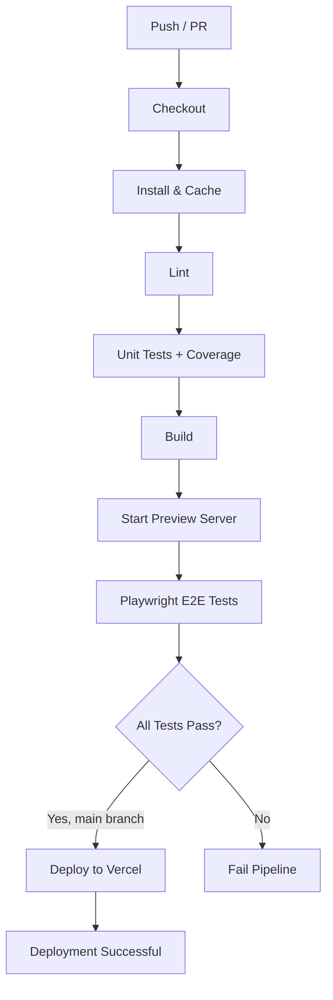

# Testing Strategy & CI/CD Pipeline Plan

## Overview

This document outlines a comprehensive testing strategy and CI/CD pipeline for the job-backlog project. The goal is to ensure code quality, automate testing, and enable reliable deployments.

## 1. Testing Strategy

### 1.1 Unit Testing with Vitest

**Scope:**
- **Utility functions** (`src/lib/utils.ts`) – test `cn` class merging.
- **Custom hooks** (`src/hooks/use-mobile.tsx`, `src/hooks/use-toast.ts`) – test responsive behavior and toast interactions.
- **React components** – test `NavLink` component and the main `Index` page logic (sorting, filtering, status updates).
- **Supabase integration** – mock Supabase client to test data fetching and mutations without hitting real API.

**Mock Strategy:**
- Use `vi.mock()` to replace `@/integrations/supabase/client` with a mocked Supabase client.
- For browser APIs (matchMedia), provide Jest‑DOM polyfills already present in `src/test/setup.ts`.

**Coverage Thresholds:**
- **Lines:** 90%
- **Branches:** 80%
- **Functions:** 85%
- **Statements:** 90%

These thresholds will be enforced in CI; lower coverage will fail the build.

**Test File Structure:**
- Place unit test files next to the source files with the `.test.ts` or `.test.tsx` suffix.
- Example: `src/components/NavLink.test.tsx`, `src/hooks/use-mobile.test.tsx`.
- For page‑level tests, create `src/pages/Index.test.tsx`.

**Recommended Test Commands:**
- `npm run test` – run unit tests once.
- `npm run test:watch` – run in watch mode (existing).
- `npm run test:coverage` – generate coverage report (to be added).

### 1.2 Integration Testing with Supabase

**Approach:** Use a dedicated test Supabase project with a seeded database.
- Run against a real Supabase instance in CI to verify actual API contracts.
- Use a separate table (e.g., `tracks_test`) or a transaction‑based cleanup to avoid polluting production data.

**Tools:** Vitest with a global setup script that seeds the test database before the test suite and tears it down afterward.

**Decision:** For simplicity, start with mocked Supabase in unit tests, and rely on Playwright E2E tests for real integration.

### 1.3 End‑to‑End Testing with Playwright

**User Flows to Cover:**
1. **Application Load** – Verify page renders, header present, status chips show counts.
2. **Table Sorting** – Click each sortable column header, verify order changes.
3. **Status Update** – Select a different status from a row’s dropdown, confirm UI updates and toast appears.
4. **Error Handling** – Simulate network error (via request interception) and verify error message displayed.
5. **404 Navigation** – Visit a non‑existent route, confirm custom 404 page appears.

**Test Database:** Use the same Supabase project as development but with a pre‑seeded `tracks` table containing known test data. A seeding script will run before the Playwright suite.

**Playwright Configuration:** Extend the existing `playwright.config.ts` with:
- `baseURL` set to `http://localhost:8080`
- `timeout` increased to 30 s for CI
- `retries` set to 1 for flaky tests
- `trace` enabled on first retry for debugging
- `use` block with `viewport` and `screenshot: 'only-on-failure'`

**Test File Location:** `tests/e2e/` directory (to be created) with files like `app.spec.ts`, `sorting.spec.ts`.

**Recommended Commands:**
- `npm run test:e2e` – run Playwright tests headlessly.
- `npm run test:e2e:ui` – open Playwright UI.
- `npm run test:e2e:debug` – run with dev tools.

### 1.4 Test Reporting

- **Unit test coverage:** Output HTML report to `coverage/` directory, publish in CI as artifact.
- **Playwright reports:** Generate HTML report with `playwright‑html‑reporter`, store as CI artifact.
- **Badges:** Use shields.io to add coverage and CI status badges to README.

## 2. CI/CD Pipeline

### 2.1 GitHub Actions Workflow

**File:** `.github/workflows/ci.yml`

**Triggers:** On push to any branch, and on pull request to `main`.

**Jobs:**

1. **Lint & Unit Tests**
   - Checkout code
   - Setup Node.js (version from `.nvmrc` or 20)
   - Install dependencies with `npm ci`
   - Cache `node_modules` and `~/.npm`
   - Run `npm run lint`
   - Run `npm run test:coverage` (unit tests with coverage)
   - Upload coverage report as artifact

2. **Build**
   - Depends on lint & unit tests passing
   - Build the application with `npm run build`
   - Upload build artifacts (optional)

3. **E2E Tests**
   - Depends on build succeeding (requires built app)
   - Start a local server with `npm run preview` (or serve `dist` with `serve`)
   - Install Playwright browsers (cached)
   - Run `npm run test:e2e` with environment variables pointing to test Supabase project
   - Upload Playwright report and traces as artifacts

4. **Deploy (main branch only)**
   - If all previous jobs pass and the branch is `main`, deploy to Vercel.
   - Use `vercel‑deploy‑action` with project ID and token stored as secrets.

### 2.2 Caching Strategy

- Cache key: `${{ runner.os }}-npm-${{ hashFiles('package-lock.json') }}`
- Cache paths: `node_modules`, `~/.npm`, `~/.cache/ms-playwright`

### 2.3 Environment Variables

**Secrets Required in GitHub Repository:**
- `VITE_SUPABASE_URL` – URL of the test Supabase project (or production if safe)
- `VITE_SUPABASE_ANON_KEY` – anon key for that project
- `VERCEL_PROJECT_ID` – for deployment automation
- `VERCEL_TOKEN` – for deployment automation

**Handling in Workflow:**
- Pass secrets as environment variables to the workflow steps.
- For Playwright tests, also set `SUPABASE_URL` and `SUPABASE_ANON_KEY` as `process.env` (via `dotenv` configuration).

### 2.4 Deployment Automation

**Target:** Vercel (already recommended in README).

**Steps:**
- Use official `vercel/action` to deploy on push to `main`.
- Configure the action to auto‑detect project settings.
- Add environment variables in Vercel dashboard (or via CLI) to match secrets.

**Alternative:** Netlify deployment using `netlify/action`.

## 3. File Modifications

### 3.1 Package.json Scripts Additions

```json
"scripts": {
  "test:coverage": "vitest run --coverage",
  "test:e2e": "playwright test",
  "test:e2e:ui": "playwright test --ui",
  "test:e2e:debug": "playwright test --debug",
  "playwright:install": "playwright install --with-deps"
}
```

### 3.2 Vitest Configuration Update

Add coverage provider to `vitest.config.ts`:

```ts
import { defineConfig } from "vitest/config";
import react from "@vitejs/plugin-react-swc";
import path from "path";

export default defineConfig({
  plugins: [react()],
  test: {
    environment: "jsdom",
    globals: true,
    setupFiles: ["./src/test/setup.ts"],
    include: ["src/**/*.{test,spec}.{ts,tsx}"],
    coverage: {
      provider: "v8",
      reporter: ["text", "json", "html"],
      thresholds: {
        lines: 90,
        branches: 80,
        functions: 85,
        statements: 90,
      },
    },
  },
  resolve: {
    alias: { "@": path.resolve(__dirname, "./src") },
  },
});
```

### 3.3 Playwright Configuration Update

Update `playwright.config.ts` for CI and local development:

```ts
import { defineConfig, devices } from "@playwright/test";

export default defineConfig({
  timeout: 30000,
  retries: process.env.CI ? 1 : 0,
  workers: process.env.CI ? 2 : undefined,
  use: {
    baseURL: process.env.PLAYWRIGHT_TEST_BASE_URL || "http://localhost:8080",
    screenshot: "only-on-failure",
    trace: process.env.CI ? "on-first-retry" : "retain-on-failure",
  },
  webServer: {
    command: "npm run preview",
    url: "http://localhost:8080",
    reuseExistingServer: !process.env.CI,
  },
});
```

### 3.4 GitHub Actions Workflow File

Create `.github/workflows/ci.yml` (content detailed in Appendix A).

### 3.5 README Updates

Add the following sections:

**Testing**
- How to run unit tests and generate coverage.
- How to run Playwright tests locally.
- Explanation of test structure.

**CI/CD**
- Badge showing GitHub Actions status.
- Description of the automated pipeline.
- How to view test reports and coverage.

**Contributing**
- Guidelines for writing tests.
- Requirement for tests to pass before merge.

**Environment Variables for CI**
- Instructions for setting up secrets in GitHub.

## 4. Implementation Steps

1. Update `package.json` with new scripts.
2. Modify `vitest.config.ts` for coverage.
3. Extend `playwright.config.ts` with CI settings.
4. Create the directory `tests/e2e/` and write initial Playwright spec files.
5. Create `.github/workflows/ci.yml`.
6. Add GitHub secrets for Supabase and Vercel.
7. Update README.md with new sections and badges.
8. Run the pipeline locally to verify everything works.

## 5. Appendix A – GitHub Actions Workflow YAML

```yaml
name: CI/CD Pipeline

on:
  push:
    branches: [ "**" ]
  pull_request:
    branches: [ "main" ]

jobs:
  lint-and-unit:
    runs-on: ubuntu-latest
    steps:
      - uses: actions/checkout@v4
      - uses: actions/setup-node@v4
        with:
          node-version: 20
          cache: 'npm'
      - name: Install dependencies
        run: npm ci
      - name: Lint
        run: npm run lint
      - name: Unit tests with coverage
        run: npm run test:coverage
      - name: Upload coverage report
        uses: actions/upload-artifact@v4
        with:
          name: coverage-report
          path: coverage/

  build:
    runs-on: ubuntu-latest
    needs: lint-and-unit
    steps:
      - uses: actions/checkout@v4
      - uses: actions/setup-node@v4
        with:
          node-version: 20
          cache: 'npm'
      - name: Install dependencies
        run: npm ci
      - name: Build
        run: npm run build
      - name: Upload build artifacts
        uses: actions/upload-artifact@v4
        with:
          name: build-output
          path: dist/

  e2e:
    runs-on: ubuntu-latest
    needs: build
    env:
      VITE_SUPABASE_URL: ${{ secrets.VITE_SUPABASE_URL }}
      VITE_SUPABASE_ANON_KEY: ${{ secrets.VITE_SUPABASE_ANON_KEY }}
    steps:
      - uses: actions/checkout@v4
      - uses: actions/setup-node@v4
        with:
          node-version: 20
          cache: 'npm'
      - name: Install dependencies
        run: npm ci
      - name: Install Playwright browsers
        run: npx playwright install --with-deps
      - name: Build app
        run: npm run build
      - name: Start preview server
        run: npm run preview &
        env:
          PORT: 8080
      - name: Run Playwright tests
        run: npm run test:e2e
      - name: Upload Playwright report
        if: always()
        uses: actions/upload-artifact@v4
        with:
          name: playwright-report
          path: playwright-report/

  deploy:
    runs-on: ubuntu-latest
    if: github.ref == 'refs/heads/main' && needs.lint-and-unit.result == 'success' && needs.e2e.result == 'success'
    needs: [lint-and-unit, e2e]
    steps:
      - uses: actions/checkout@v4
      - uses: amondnet/vercel-action@v25
        with:
          vercel-token: ${{ secrets.VERCEL_TOKEN }}
          vercel-org-id: ${{ secrets.VERCEL_ORG_ID }}
          vercel-project-id: ${{ secrets.VERCEL_PROJECT_ID }}
          working-directory: ./
          vercel-args: '--prod'
```

## 6. Appendix B – Mermaid Diagram of CI/CD Flow



## 7. Next Steps

After this plan is approved, switch to **Code mode** to implement the changes. The implementation will follow the order outlined in Section 4.

---
*Last updated: 2026‑04‑07*