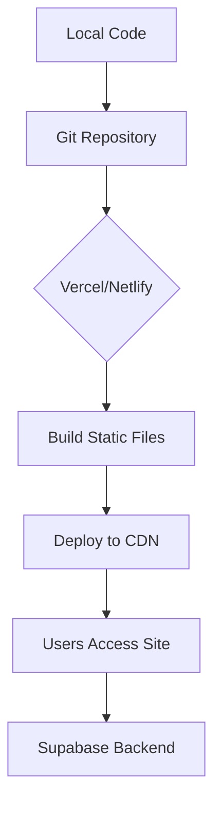

# Local Development & Deployment Plan
## job-backlog Website

### Overview
This project is a Vite + React + TypeScript single-page application (SPA) that connects to a Supabase backend for data persistence. The application is a job tracking dashboard that displays records from a `tracks` table and allows status updates.

The current codebase is functional but lacks environment configuration, deployment documentation, and security best practices. This document outlines the steps to get the website running locally and deploy it to a cloud provider.

---

## 1. Missing Pieces

| Item | Description | Priority |
|------|-------------|----------|
| `.env` / `.env.example` | Environment variable definitions for Supabase credentials | High |
| Environment‑variable‑aware Supabase client | Hardcoded URL and anon key in `src/integrations/supabase/client.ts` | High |
| Local development instructions | No README guidance | Medium |
| Deployment configuration | No `vercel.json`, `netlify.toml`, or CI/CD scripts | Medium |
| Database schema documentation | Missing SQL migrations for the `tracks` table | Medium |
| Security review | Public Supabase anon key may need rotation | Low |

---

## 2. Local Development Setup

### Prerequisites
- Node.js 18+ or Bun 1.0+
- Git

### Steps

1. **Clone the repository**
   ```bash
   git clone <repository-url>
    cd job-fit-apply-ai-backlog
   ```

2. **Install dependencies**
   Using npm (or bun if preferred):
   ```bash
   npm install
   # or
   bun install
   ```

3. **Create environment file**
   Copy the provided `.env.example` (see Section 5) to `.env` and fill in your Supabase credentials (optional – the hardcoded credentials will work for the original Lovable demo project).

4. **Start the development server**
   ```bash
   npm run dev
   # or
   bun run dev
   ```
   The server will start at `http://localhost:8080` (configured in `vite.config.ts`).

5. **Verify connectivity**
   Open the browser and confirm the dashboard loads job records. If you see an error, check the browser console and ensure the Supabase project is accessible.

### Troubleshooting
- If you see CORS errors, verify that your Supabase project has the correct site URL allowed in the Supabase dashboard (Settings → API).
- If the `tracks` table is empty, you may need to import sample data or create the schema (see Appendix A).

---

## 3. Cloud Deployment

### Recommended Provider: **Vercel**
Vercel provides excellent support for Vite/React SPAs, automatic environment variable management, and a simple git‑based workflow.

#### Deployment Steps

1. **Push the code to a Git repository** (GitHub, GitLab, or Bitbucket).

2. **Sign up at [vercel.com](https://vercel.com)** and import the repository.

3. **Configure environment variables** in the Vercel project settings:
   - `VITE_SUPABASE_URL`
   - `VITE_SUPABASE_ANON_KEY`

4. **Adjust build settings** (if needed):
   - Build Command: `npm run build` (or `bun run build`)
   - Output Directory: `dist`
   - Install Command: `npm install` (or `bun install`)

5. **Deploy** – Vercel will automatically deploy on every push to the main branch.

#### Alternative Providers
- **Netlify**: Similar to Vercel; add a `netlify.toml` with `publish = "dist"` and redirect rules for SPAs.
- **AWS Amplify / S3 + CloudFront**: Suitable for teams already using AWS; requires more manual configuration.
- **GitHub Pages**: Free but requires a custom workflow to handle client‑side routing.

### Deployment Diagram


---

## 4. Environment Configuration

### File Structure
```
job-fit-apply-ai-backlog/
├── .env.example          # Template with placeholder variables
├── .env                  # Local secrets (git‑ignored)
├── .env.production       # Optional production‑specific variables
└── src/integrations/supabase/client.ts   # Updated to use env vars
```

### `.env.example` Template
```bash
# Supabase Configuration
VITE_SUPABASE_URL=https://your-project.supabase.co
VITE_SUPABASE_ANON_KEY=your-anon-key-here
```

### Required Changes to `client.ts`
Replace the hardcoded values with environment‑variable reads:

```typescript
import { createClient } from '@supabase/supabase-js';

const supabaseUrl = import.meta.env.VITE_SUPABASE_URL;
const supabaseAnonKey = import.meta.env.VITE_SUPABASE_ANON_KEY;

export const supabase = createClient(supabaseUrl, supabaseAnonKey);
```

This change maintains backward compatibility with the original Lovable project while allowing custom Supabase projects.

---

## 5. Necessary Code Modifications

1. **Update `src/integrations/supabase/client.ts`** as described above.
2. **Add `.env` to `.gitignore`** (already present).
3. **Create a basic `README.md`** with setup and deployment instructions.
4. **Optional: Add a `vercel.json`** for Vercel‑specific settings (e.g., routing rewrites for SPAs).

Example `vercel.json`:
```json
{
  "rewrites": [{ "source": "/(.*)", "destination": "/index.html" }]
}
```

---

## 6. Supabase Project Setup (Appendix)

If you wish to use your own Supabase instance:

1. Create a new project at [supabase.com](https://supabase.com).
2. Run the following SQL in the Supabase SQL editor to create the `tracks` table:

```sql
CREATE TABLE tracks (
  id bigint PRIMARY KEY GENERATED ALWAYS AS IDENTITY,
  company text NOT NULL,
  role_title text NOT NULL,
  location text,
  remote_policy text,
  fit_score integer,
  job_url text,
  artifact_url text,
  tech_stack text[],
  status text NOT NULL DEFAULT 'backlog',
  created_at timestamptz DEFAULT now(),
  duplicate boolean DEFAULT false
);
```

3. Enable Row Level Security (RLS) if needed and add policies.
4. Copy the project URL and anon key from Settings → API into your `.env` file.

---

## 7. Next Steps & Recommendations

- **Immediate**: Apply the environment variable changes and test locally.
- **Short‑term**: Deploy to Vercel using the provided steps.
- **Long‑term**: Consider rotating the Supabase anon key and implementing proper RLS policies for production data.

---

## 8. Support

If you encounter issues:
1. Check the browser console for errors.
2. Verify that environment variables are correctly loaded (Vite prefixes with `VITE_`).
3. Consult the [Vite](https://vitejs.dev/guide/) and [Supabase](https://supabase.com/docs) documentation.

---

*Plan generated on 2026‑04‑07.*
