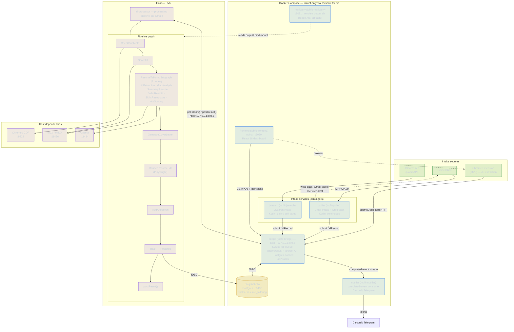

# Job-Fit-Apply-AI — Architecture Diagram

A monorepo AI pipeline that automates the job-search workflow: intake → classify →
scrape → score → tailor → render → draft reply → track → surface in the dashboard.

The **datastore + app tier** runs as **Docker Compose** (tailnet-only via **Tailscale
Serve**); the **LLM/browser pipeline worker** runs on the **host** and reaches the
bridge over a published loopback port.

## Reading the diagram

- **Intake** — three sources feed one queue. `poller` (Gmail) and `jsearch` (RapidAPI)
  are containers that `submit JdRecord` to the bridge; the Chrome extension submits
  directly from the browser.
- **Bridge** is the hub: a SQLite job queue (`claim()`/`result()`), an artifact API, and
  the Postgres-backed `/api/tracks` API the dashboard reads.
- **Host worker** (`jd-processor`, PM2) polls the bridge over loopback, runs the node
  graph (dedup → score → tailor → cover letter → PDF → track), and posts results back.
  It depends on Chrome/CDP for scraping and MLX/Ollama for the LLM nodes.
- **Write-back** — the Gmail poller applies labels and creates recruiter reply drafts
  (nothing is sent automatically).
- **Surfaces** — `frontend` (React dashboard), `markserv` (rendered reports), and
  `notifier` (Discord/Telegram from the completed-event stream). Every container binds
  host loopback only and is reached over the tailnet via Tailscale Serve.
