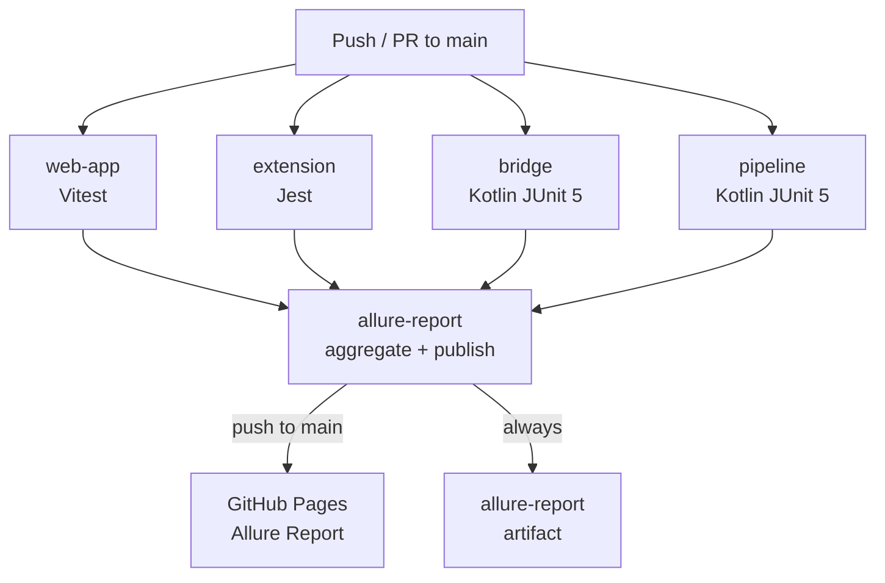

# GitHub Actions CI/CD Workflow Design

## Overview

Design for the GitHub Actions CI workflow that runs all tests across the monorepo and publishes a combined Allure report to GitHub Pages.

## Project Context

| Property | Value |
|----------|-------|
| Language | Kotlin / JVM 21 |
| Build Tool | Gradle (Kotlin DSL) |
| Java Version | 21 (Temurin) |
| Test Framework | JUnit Jupiter 5 + Allure |
| Frontend test | Vitest (web-app), Jest (extension) |

## Workflow Design

### Triggers

```yaml
on:
  push:
    branches: [main, develop]
  pull_request:
    branches: [main, develop]
```

### Concurrency

Cancel in-progress runs on the same branch to avoid queueing stale builds:

```yaml
concurrency:
  group: ci-${{ github.ref }}
  cancel-in-progress: true
```

### Job Structure

Five parallel jobs feed one Allure aggregation job:

```
web-app ──┐
extension ─┼──► allure-report → GitHub Pages  (main only)
bridge ────┤
pipeline ──┘
```

| Job | Runner | Command | Notes |
|-----|--------|---------|-------|
| `web-app` | ubuntu-latest | `npm run test:unit` | Vitest + coverage |
| `extension` | ubuntu-latest | `npm run test:coverage` | Jest; lint on `continue-on-error` |
| `bridge` | ubuntu-latest | `./gradlew test` | JUnit 5 + Allure |
| `pipeline` | ubuntu-latest | `./gradlew test` (unit) + `./gradlew test` (integration, `continue-on-error`) | JUnit 5 + Allure + JaCoCo |
| `allure-report` | ubuntu-latest | `allure generate` | depends on all four; `if: always()` |

### Pipeline unit test scope

```yaml
run: ./gradlew test \
  --tests "com.jd.pipeline.nodes.*" \
  --tests "com.jd.pipeline.cli.*" \
  --tests "com.jd.pipeline.pipeline.*" \
  --tests "com.jd.pipeline.utils.*" \
  --tests "com.jd.pipeline.fixtures.*" \
  --tests "com.jd.pipeline.functional.*"
```

Integration tests (`com.jd.pipeline.integration.*`) run separately with `continue-on-error: true` because they require live credentials.

### Caching Strategy

Each Kotlin job gets its own Gradle cache key scoped to the service directory:

```yaml
key: ${{ runner.os }}-gradle-pipeline-${{ hashFiles('services/job-fit-apply-ai-pipeline/**/*.gradle*', '**/gradle-wrapper.properties') }}
```

### Allure aggregation

All four jobs upload an `allure-results-<job>` artifact. The aggregation job:

1. Downloads all four artifacts into `allure-results/<job>/`
2. Merges them into `merged-allure-results/` (flat copy)
3. Restores historical trend from the `gh-pages` branch
4. Generates the HTML report with `allure generate`
5. Publishes to GitHub Pages on pushes to `main` only

## Mermaid Diagram



## Key Decisions

| Decision | Rationale |
|----------|-----------|
| `ubuntu-latest` runner | Standard, fast, well-supported |
| Temurin Java 21 | Matches local JVM toolchain; LTS |
| Separate unit / integration steps for pipeline | Integration tests need live credentials; `continue-on-error: true` prevents blocking the Allure report |
| `if: always()` on allure-report | Report is published even when tests fail — failures are visible in the report itself |
| Pages publish only on `main` push | Avoids overwriting the canonical report with PR runs |
| Per-service Gradle cache keys | Prevents cross-service cache thrashing |
