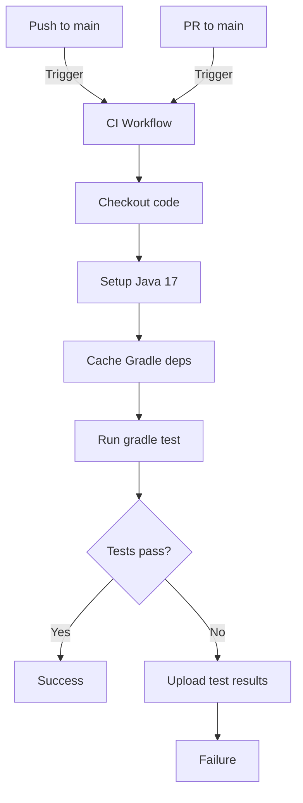

# GitHub Actions CI/CD Workflow Design

## Overview

Design for a GitHub Actions CI/CD workflow that runs all tests for a Kotlin project using Gradle.

## Project Context

| Property | Value |
|----------|-------|
| Language | Kotlin 1.9.22 |
| Build Tool | Gradle (Kotlin DSL) |
| Java Version | 17 (via `jvmToolchain(17)`) |
| Test Framework | JUnit Jupiter 5.10.1 |
| Test Command | `gradle test` |

## Workflow Design

### Triggers

```yaml
on:
  push:
    branches: [main]
  pull_request:
    branches: [main]
```

**Rationale:**
- Runs on push to `main` to catch integration issues
- Runs on pull requests to `main` to validate changes before merge
- Using `pull_request` (not `pull_request_target`) for security and performance

### Java Version Matrix Strategy

**Decision: Single Java 17 Job**

The project uses `jvmToolchain(17)` which hardcodes Java 17. A single job approach is appropriate because:

1. The project is configured for Java 17 specifically
2. No compatibility testing across multiple Java versions is required
3. Simpler workflow, faster execution

### Job Structure

```yaml
run: ./gradlew test \
  --tests "com.jd.pipeline.nodes.*" \
  --tests "com.jd.pipeline.cli.*" \
  --tests "com.jd.pipeline.pipeline.*" \
  --tests "com.jd.pipeline.utils.*" \
  --tests "com.jd.pipeline.fixtures.*" \
  --tests "com.jd.pipeline.functional.*" \
  --tests "com.jd.pipeline.client.*" \
  --tests "com.jd.pipeline.config.*" \
  --tests "com.jd.pipeline.models.*" \
  --tests "com.jd.pipeline.state.*"
```

### Caching Strategy

**Two-tier caching approach:**

1. **Gradle Wrapper Cache**: Caches the Gradle wrapper files (`~/.gradle/wrapper`)
2. **Gradle Dependencies Cache**: Caches downloaded dependencies (`~/.gradle/caches`)

```yaml
- name: Cache Gradle packages
  uses: actions/cache@v4
  with:
    path: |
      ~/.gradle/wrapper
      ~/.gradle/caches
    key: ${{ runner.os }}-gradle-${{ hashFiles('**/*.gradle.kts', '**/gradle-wrapper.properties') }}
    restore-keys: |
      ${{ runner.os }}-gradle-
```

**Key decisions:**
- Cache key includes `*.gradle.kts` and `gradle-wrapper.properties` for accurate invalidation
- Restore keys use prefix matching for partial cache hits
- Using `actions/cache@v4` (latest version)

### Step Details

| Step | Action | Purpose |
|------|--------|---------|
| Checkout | `actions/checkout@v4` | Fetch repository code |
| Setup Java | `actions/setup-java@v4` | Configure Java 17 with Gradle |
| Cache | `actions/cache@v4` | Cache Gradle dependencies |
| Test | `./gradlew test` | Execute all tests |

## Workflow File Location

```
.github/workflows/ci.yml
```

## Reference Implementation

```yaml
name: CI

on:
  push:
    branches: [main]
  pull_request:
    branches: [main]

jobs:
  test:
    runs-on: ubuntu-latest
    
    steps:
      - name: Checkout code
        uses: actions/checkout@v4
      
      - name: Setup Java 17
        uses: actions/setup-java@v4
        with:
          java-version: '17'
          distribution: 'temurin'
          cache: 'gradle'
      
      - name: Run tests
        run: ./gradlew test
      
      - name: Upload test results
        if: always()
        uses: actions/upload-artifact@v4
        with:
          name: test-results
          path: build/reports/tests/test
```

## Key Decisions Summary

| Decision | Rationale |
|----------|-----------|
| `ubuntu-latest` runner | Standard, fast, well-supported |
| Temurin distribution | Production-grade OpenJDK, well-maintained |
| `cache: 'gradle'` in setup-java | Official caching mechanism, simpler than manual cache |
| Upload test results | Enables artifact retention for debugging |
| Conditional upload | Always upload even if tests fail |

## Additional Considerations

### Test Results
- Reports stored in `build/reports/tests/test/`
- Uploaded as artifact regardless of test outcome
- Retention can be configured at repository level

### Permissions
- Workflow uses default GITHUB_TOKEN permissions (read/write for checks)
- No additional permissions required

### Failure Handling
- Test failures will cause job to fail
- Caching failures are non-blocking (workflow continues)
- Artifacts available for post-mortem analysis

## Mermaid Diagram



## Out of Scope

- Deployment workflows
- Multi-version Java testing
- Custom Gradle configurations
- Integration test environments
- Code coverage reporting