# JD Pipeline (Kotlin)

[](https://github.com/dkkyai/jd-pipeline-kotlin/actions/workflows/ci.yml)
[](https://github.com/dkkyai/jd-pipeline-kotlin/actions/workflows/tests.yml)
[](LICENSE)
[](https://openjdk.org/projects/jdk/21/)

A Kotlin pipeline that turns inbound job opportunities into tailored resume + cover letter packets, end-to-end. It reads from Gmail or the JSearch API, scores each role against your candidate profile, and — for jobs above the fit threshold — rewrites your resume, generates a cover letter, renders a PDF, and tracks the application in Supabase.

The pipeline is built around a single structured **candidate profile** (`config/candidate_profile.json`). Every node consumes that profile directly; the tailored output is structured data all the way until the final HTML render.

## What it does

- Fetches recruiter emails and job-board digests from Gmail, or pulls live listings from the JSearch API.
- Classifies the email, expands digests into per-job records, and scrapes each job page (HTTP for most boards, Playwright + Chrome profile for LinkedIn).
- Deduplicates against Supabase so you don't waste LLM budget re-scoring jobs you've already seen.
- Scores fit against your profile and extracts a structured JD record in a single combined LLM call.
- For jobs above the fit threshold, runs the `ResumeTailoringSubgraph` against your structured profile — rewrites summary, bullets per role, and the skills section — then renders a tailored HTML and PDFs it via Playwright.
- Tracks every job in Supabase and, when the source is a recruiter email, drafts a reply with your preferences pre-filled.

## Quick start

After cloning, one command populates every personalised file from your existing resume:

```bash
./gradlew run --args="--init-profile path/to/your_resume.pdf"
```

Supported formats: `.pdf`, `.docx`, `.html`, `.md`.

`--init-profile` parses your resume into a structured `config/candidate_profile.json`, opens `$EDITOR` so you can fill in the preference fields a resume can't supply (visa, comp, work arrangement, …), then renders `generated_resume.html` and `TAILOR_SKILL.md` from your profile. See [First-time setup](#first-time-setup---init-profile) for the full walk-through.

> You don't need Gmail or Supabase configured to run `--init-profile`. Those layers come in once you want to drive the pipeline from real email or persist scored jobs.

## Pipeline

The main pipeline lives in [`JDPipeline.kt`](src/main/kotlin/com/jd/pipeline/pipeline/JDPipeline.kt).

```mermaid
flowchart TD
    Start(["Input Email"]) --> Scan["ScanEmailNode"]
    Scan --> JobBoard{"Job board digest?"}
    JobBoard -->|Yes| ExtractLinks["Extract job URLs from digest"]
    JobBoard -->|No| RecruiterPosting{"Recruiter job posting?"}

    RecruiterPosting -->|No| SaveNonJob["SaveJobDescriptionNode"]
    SaveNonJob --> EndNonJob(["End"])
    RecruiterPosting -->|Yes| ScrapeSingle["ScrapeJdNode"]

    ExtractLinks --> ChildLoop["Scrape each child job"]
    ChildLoop --> ChildScrape["ScrapeJdNode"]
    ChildScrape --> ChildSave["SaveJobDescriptionNode"]
    ChildSave --> ScoreRoute

    ScrapeSingle --> SaveSingle["SaveJobDescriptionNode"]
    SaveSingle --> ScoreRoute

    subgraph ScoreRoute ["Score and Route"]
        direction TB
        Duplicate["CheckDuplicateNode"] --> DupDecision{"duplicate?"}
        DupDecision -->|Yes| TrackOnly["SupabaseTrackNode"]
        DupDecision -->|No| Score["ScoreFitNode\n(score + JD extraction, one call)"]
        Score --> ActionDecision{"action != tailor?"}
        ActionDecision -->|Yes| TrackOnly
        ActionDecision -->|No| Tailor["ResumeTailoringSubgraph"]

        subgraph Tailor ["ResumeTailoringSubgraph"]
            direction TB
            T1["JdExtractionNode\n(skip if score_fit extracted)"] --> T2["GapAnalysisNode"]
            T2 --> T3["SummaryRewriteNode"]
            T3 --> T4["BulletRewriteNode"]
            T4 --> T5["SkillsRestructureNode"]
            T5 --> T6["AtsScoringNode"]
        end

        Tailor --> Cover["GenerateCoverLetterNode"]
        Cover --> Render["RenderResumePdfNode\n(Playwright headless)"]
        Render --> Artifact["AddArtifactUrlNode"]
        Artifact --> TrackTailor["SupabaseTrackNode"]
        TrackOnly --> ReplyDecision{"Recruiter email\nand action == tailor?"}
        TrackTailor --> ReplyDecision
        ReplyDecision -->|Yes| Draft["CreateDraftReplyNode"]
        ReplyDecision -->|No| RouteEnd(["End"])
        Draft --> RouteEnd
    end
```



The tailoring subgraph operates entirely on structured data: each node reads `candidateProfile` from the pipeline state, the rewrites populate a `TailoredProfile` (rewritten summary, per-role bullets, JD-aligned skill groups), and [`GenerateResumeHtmlNode.renderFromProfile()`](src/main/kotlin/com/jd/pipeline/nodes/GenerateResumeHtmlNode.kt) produces `tailored_resume.html` from that structured payload in a single LLM call.

### Tailoring subgraph — what it produces

For every tailored job, `ResumeTailoringSubgraph` writes to `output/<timestamp>_<company>_<role>/`:

| File | Description |
|---|---|
| `tailored_resume.html` | Tailored HTML rendered from your `TailoredProfile` (rewritten summary + bullets + JD-aligned skill groups) |
| `<AUTHOR_NAME>_<Role>.pdf` | PDF rendered from `tailored_resume.html` via Playwright |
| `tailored_summary.txt` | Rewritten professional summary |
| `tailored_bullets.txt` | Original → rewritten bullet pairs with alignment scores |
| `restructured_skills.txt` | Plain-text skills section ready to copy |
| `ats_score.txt` | ATS scorecard (overall + 5 sub-scores, remaining gaps, top improvements) |
| `gap_analysis.json` | Machine-readable skills gap table |
| `cover_letter.txt` | Tailored cover letter |
| `score_fit.txt` | Fit score, reasoning, strengths, gaps |

## Requirements

- **Java 21** (Temurin / Adoptium recommended)
- **Gradle wrapper** — bundled, use `./gradlew`
- **At least one LLM backend**: local Ollama, MiniMax cloud, DeepSeek cloud, or Ollama Cloud
- **Chrome** (only if you intend to scrape LinkedIn job pages — Playwright launches your Chrome profile)
- **Gmail OAuth credentials** (only if you want to drive the pipeline from your inbox)
- **Supabase project** (only if you want to persist scored jobs)

## First-time setup: `--init-profile`

```bash
./gradlew run --args="--init-profile path/to/your_resume.pdf"
```

What it does:

1. Extracts text from the resume.
2. Calls `PROFILE_GEN_MODEL` (defaults to `RESUME_GEN_MODEL`) with [`PROFILE_GEN_SKILL.md`](src/main/resources/skills/PROFILE_GEN_SKILL.md) to produce a draft `config/candidate_profile.json`.
3. Opens the draft in your `$EDITOR` so you can fill in the ~14 preference fields a resume cannot supply (visa, target compensation, work arrangement, etc.). Save and exit when done.
4. Renders [`src/main/resources/resume/generated_resume.html`](src/main/resources/resume/) from [`base_resume.template.html`](src/main/resources/resume/base_resume.template.html) + your profile.
5. Renders [`src/main/resources/skills/TAILOR_SKILL.md`](src/main/resources/skills/) from [`TAILOR_SKILL.template.md`](src/main/resources/skills/TAILOR_SKILL.template.md) + a candidate-context block built from your profile.

The three rendered files (`candidate_profile.json`, `generated_resume.html`, `TAILOR_SKILL.md`) are **gitignored** — your personal data never gets committed. The committed templates are shared by every contributor.

> **Backups:** any pre-existing copy of a generated file is moved aside with a timestamped `.bak` suffix (e.g. `candidate_profile.20260510_142233.json.bak`) before being overwritten, so repeated `--init-profile` runs never trample prior data.

[`SCORE_SKILL.md`](src/main/resources/skills/SCORE_SKILL.md) is already runtime-templated via `{{CANDIDATE_PROFILE}}` — `ScoreFitNode` substitutes your profile into it on every score call, so it does not need a separate hand-edit.

## Environment + LLM setup

Copy [`.env.example`](.env.example) to `.env` and fill in at least one LLM backend.

### LLM backend (pick one)

| Backend | How to enable | Notes |
|---|---|---|
| **Ollama (local)** | Run `ollama serve`; leave `OLLAMA_LOCAL_BASE_URL=http://localhost:11434` | Free, runs on your machine; the default in `.env.example`. |
| **Ollama Cloud** | Set `OLLAMA_API_KEY` and append `:ollama-cloud` to any model name (e.g. `SCORE_MODEL=qwen3:32b:ollama-cloud`) | Pay per token; same model namespace as local Ollama. |
| **MiniMax** | Set `MINIMAX_API_KEY`, use `:cloud` suffix (e.g. `SCORE_MODEL=MiniMax-M2.7:cloud`) | Strong long-context performance. |
| **DeepSeek** | Set `DEEPSEEK_API_KEY`, use `:cloud` suffix (e.g. `SCORE_MODEL=deepseek-reasoner:cloud`) | `deepseek-reasoner` for chain-of-thought scoring. |

### Optional integrations

Gmail (drives email-sourced runs):
```bash
./gradlew run --args="--reauth"        # one-time OAuth flow
./gradlew run --args="--check-token"   # verify token
```
See the [Gmail token management](#gmail-token-management) section for the full flow.

Supabase (job tracking): set `SUPABASE_PROJECT_URL` and `SUPABASE_SERVICE_ROLE_KEY` (or `SUPABASE_KEY`) in `.env`.

JSearch (API-driven runs instead of Gmail): set `JSEARCH_API_KEY` and run with `--jsearch`.

## Configuration reference

All bindings are in [`Config.kt`](src/main/kotlin/com/jd/pipeline/config/Config.kt). [`.env.example`](.env.example) is the canonical source of the full variable list.

### Models

All node-level model variables default to `qwen3.5:9b-q4_K_M` (a sensible local-Ollama default). Override per node in `.env`:

| Variable | Used by |
|---|---|
| `SCAN_MODEL` | `ScanEmailNode` — email classification and field extraction |
| `SCRAPE_MODEL` (defaults to `SCAN_MODEL`) | `ScrapeJdNode` — job-page structured extraction |
| `SCORE_MODEL` | `ScoreFitNode` — combined fit scoring + JD structure extraction |
| `RESUME_REASONING_MODEL` | `SummaryRewriteNode`, `BulletRewriteNode` — creative rewriting (temp=0.4, thinking enabled) |
| `SKILLS_MODEL` (defaults to `RESUME_REASONING_MODEL`) | Tailor orchestration nodes: `JdExtractionNode`, `GapAnalysisNode`, `SkillsRestructureNode`, `AtsScoringNode` |
| `COVER_LETTER_MODEL` | `GenerateCoverLetterNode` |
| `DRAFT_REPLY_MODEL` | `CreateDraftReplyNode` |
| `RESUME_GEN_MODEL` | `GenerateResumeHtmlNode` — template + structured profile → HTML resume |
| `PROFILE_GEN_MODEL` (defaults to `RESUME_GEN_MODEL`) | `GenerateCandidateProfileNode` — resume → `candidate_profile.json` |

`SCORE_MODEL` returns the fit score *and* a structured `JdStructured` object (required skills, ATS phrases, seniority, …) in a single call. `JdExtractionNode` inside the tailoring subgraph skips its LLM call when score_fit already produced the structure.

### Backend routing (`:cloud` and `:ollama-cloud` suffixes)

Append a suffix to a model name to route to a different backend:

| Suffix | Routes to |
|---|---|
| (none) | Local Ollama at `OLLAMA_LOCAL_BASE_URL` |
| `:ollama-cloud` | Ollama Cloud (requires `OLLAMA_API_KEY`) |
| `:cloud` with `MiniMax-…` prefix | MiniMax API (requires `MINIMAX_API_KEY`) |
| `:cloud` with `deepseek-…` prefix | DeepSeek API (requires `DEEPSEEK_API_KEY`) |

Examples:
```env
SCORE_MODEL=MiniMax-M2.7:cloud         # → MiniMax API
SCORE_MODEL=deepseek-reasoner:cloud    # → DeepSeek R1
SCORE_MODEL=qwen3:32b:ollama-cloud     # → Ollama Cloud
```

### Thresholds

| Variable | Default | Description |
|---|---|---|
| `FIT_THRESHOLD` | `50` | Minimum fit score to trigger tailoring |
| `DUPLICATE_WINDOW_DAYS` | `30` | Jobs seen within this window are skipped as duplicates |

### Gmail

| Variable | Default |
|---|---|
| `GMAIL_CREDENTIALS_FILE` | `gmail_credentials.json` |
| `GMAIL_TOKEN_FILE` | `tokens/gmail_token.json` |
| `GMAIL_MAX_EMAILS` | `3` |
| `GMAIL_SEARCH_QUERY` | `newer_than:7d in:inbox -label:JD_Not_Found -label:Recruiter_Response_Required` |

### LinkedIn / Playwright

| Variable | Default |
|---|---|
| `CHROME_EXECUTABLE_PATH` | `/Applications/Google Chrome.app/Contents/MacOS/Google Chrome` (macOS) |
| `CHROME_USER_DATA_DIR` | `~/Library/Application Support/Google/Chrome` (macOS) |
| `CHROME_PROFILE_DIRECTORY` | `Default` |
| `PLAYWRIGHT_TIMEOUT_MS` | `45000` |
| `PLAYWRIGHT_HEADLESS` | `false` |
| `PLAYWRIGHT_FALLBACK_ON_CAPTCHA` | `true` |

### Supabase

| Variable | Description |
|---|---|
| `SUPABASE_PROJECT_URL` | Project REST URL |
| `SUPABASE_SERVICE_ROLE_KEY` (or `SUPABASE_KEY`) | Service role key — required for inserts/updates |

## Skills (prompt files)

Prompt files live in [`src/main/resources/skills/`](src/main/resources/skills/) and are loaded at runtime — edit without recompiling.

| File | Node | Purpose |
|---|---|---|
| `SCAN_SKILL.md` | `ScanEmailNode` | Email classification and field extraction |
| `SCRAPE_SKILL.md` | `ScrapeJdNode` | Job-page structured extraction |
| `SCORE_SKILL.md` | `ScoreFitNode` | Combined fit scoring + JD structure extraction rubric (runtime-templated via `{{CANDIDATE_PROFILE}}`) |
| `JD_EXTRACTION_SKILL.md` | `JdExtractionNode` | JD structure extraction (fallback when score_fit's parse fails) |
| `GAP_ANALYSIS_SKILL.md` | `GapAnalysisNode` | Skills gap table + keyword coverage score |
| `SUMMARY_REWRITE_SKILL.md` | `SummaryRewriteNode` | Professional summary rewrite (no fabrication) |
| `BULLET_REWRITE_SKILL.md` | `BulletRewriteNode` | Per-role ATS-aligned bullet rewrite preserving quantification |
| `SKILLS_RESTRUCTURE_SKILL.md` | `SkillsRestructureNode` | Reorder and group skills into JD-aligned categories |
| `ATS_SCORING_SKILL.md` | `AtsScoringNode` | Composite ATS score (keyword 30%, skills 25%, seniority 20%, quant 15%, format 10%) |
| `DRAFT_REPLY_SKILL.md` | `CreateDraftReplyNode` | Recruiter reply draft |
| `RESUME_GEN_SKILL.md` | `GenerateResumeHtmlNode` | HTML resume generation from structured `TailoredProfile` (also handles legacy DOCX/PDF text source) |
| `PROFILE_GEN_SKILL.md` | `GenerateCandidateProfileNode` | Resume → `candidate_profile.json` |

The two `*.template.md` siblings (`TAILOR_SKILL.template.md`) and the `*.template.html`/`*.template.json` companions (`base_resume.template.html`, `candidate_profile.template.json`) are the committed templates that `--init-profile` renders into your personalised, gitignored copies.

## Running

```bash
# Compile only
./gradlew compileKotlin

# First time — populate your profile from a resume
./gradlew run --args="--init-profile path/to/your_resume.pdf"

# Batch mode (default: 3 emails from Gmail)
./gradlew run

# Limit email count
./gradlew run --args="--max-emails 10"

# Override env file (e.g. for a speed-tuned cloud config)
./gradlew run --args="--max-emails 5" -Ddotenv.file=.env.speed

# Process a specific email by subject substring
./gradlew run --args='--email "Staff SDET opportunity"'

# JSearch API mode (bypasses email scan + page scrape)
./gradlew run --args="--jsearch"

# Test modes — useful smoke tests, no Gmail/Supabase required
./gradlew run --args="--test"             # end-to-end on a sample JD string
./gradlew run --args="--test-resume"      # tailoring subgraph + PDF render with mock state
./gradlew run --args="--test-coverletter" # cover letter generation
./gradlew run --args="--test-supabase"    # Supabase connectivity
./gradlew run --args="--test-gmail"       # Gmail auth + fetch

# Generate an HTML resume from a DOCX or PDF source (no JD context)
./gradlew run --args='--resume-gen /path/to/resume.docx'
./gradlew run --args='--resume-gen /path/to/resume.pdf'
# Output: src/main/resources/resume/<filename>-generated.html
```

### JSearch API mode

Drive the pipeline against the JSearch API to discover live job listings. JSearch results bypass `ScanEmailNode` and `ScrapeJdNode` because the API returns full job descriptions.

```bash
./gradlew run --args="--jsearch"
```

Flow:
1. `JSearchClient.search()` fetches listings from the JSearch API.
2. Each `JobListing` is converted to a `JDState` via `JSearchClient.toJDState()`.
3. The state is marked with `source = "jsearch"` so `JDPipeline.invoke()` routes it directly to `scoreAndRoute()`.
4. Pipeline continues through deduplication, fit scoring, tailoring, and Supabase tracking — exactly like email-sourced jobs.

Required env: `JSEARCH_API_KEY` (RapidAPI key for JSearch).

### Gmail token management

The pipeline uses OAuth 2.0 to authenticate with Gmail. Tokens are stored at `GMAIL_TOKEN_FILE` (default `tokens/gmail_token.json`).

**One-time setup:**
1. **Create OAuth credentials** in the [Google Cloud Console](https://console.cloud.google.com/apis/credentials):
   - Create an OAuth 2.0 Client ID (Desktop app)
   - Download the JSON and save as `gmail_credentials.json`
   - Set `GMAIL_CREDENTIALS_FILE=gmail_credentials.json`
2. **Run** `./gradlew run --args="--reauth"`:
   - Open the displayed URL, authorise, copy the redirect URL back when prompted.

**Auto-reauth:** when the stored token expires or is revoked, the pipeline detects it, generates a fresh OAuth URL, and prompts you to re-authorise. No special command needed.

**Manual commands:**
```bash
./gradlew run --args="--check-token"   # verify without fetching emails
./gradlew run --args="--reauth"        # force fresh OAuth
```

## LinkedIn scraping

LinkedIn URLs are routed to the Playwright workflow in [`ScrapeJdNode.kt`](src/main/kotlin/com/jd/pipeline/nodes/ScrapeJdNode.kt). The scraper copies the configured Chrome profile to a temporary directory before launching, so your real browser stays untouched. LinkedIn can still redirect to a security checkpoint even with a signed-in profile; the node detects this and marks the scrape as failed rather than silently dropping the JD.

## Troubleshooting

### Gmail token issues

| Symptom | Fix |
|---|---|
| "Token EXPIRED" / "Token INVALID" | `./gradlew run --args="--reauth"` |
| "No stored token found" on first run | Ensure `GMAIL_CREDENTIALS_FILE` points to a valid OAuth JSON, then `--reauth` |
| OAuth redirect URL not accepted | Copy the **entire** browser address-bar URL (it contains the `code=…` query param) |

### LinkedIn scraping

| Symptom | Fix |
|---|---|
| "LinkedIn session expired" warning | Sign out and back in to LinkedIn in the Chrome profile referenced by `CHROME_PROFILE_DIRECTORY` |
| "Security verification" / checkpoint page | LinkedIn detected automation; manually complete the verification in Chrome, then retry |

### `--init-profile`

| Symptom | Fix |
|---|---|
| "Failed to parse LLM response as CandidateProfile" | Raw response is dumped to `config/candidate_profile.draft.json`. Fix and re-run, or `--init-profile <resume>` again. |
| "$EDITOR not set" | Export `$EDITOR` (e.g. `export EDITOR=vi`) or open `config/candidate_profile.json` manually and re-run. |
| `__TODO__` markers remain after editor closes | The node refuses to continue. Edit `config/candidate_profile.json` to replace every `__TODO__: …` string and re-run. |

## Project layout

```
src/main/kotlin/com/jd/pipeline/
├── cli/
│   └── Main.kt                        # CLI entry point, batch runner, test modes
├── client/
│   ├── LlmClient.kt                   # Shared LLM HTTP client (Ollama / Ollama Cloud / MiniMax / DeepSeek)
│   ├── SupabaseClient.kt              # Supabase REST client
│   └── GmailClient.kt                 # Gmail API client
├── config/
│   └── Config.kt                      # All environment variable bindings
├── models/
│   ├── CandidateProfile.kt            # Structured profile: identity, background, skills, projects
│   └── CandidatePreferences.kt        # Visa, comp, work arrangement, etc.
├── nodes/
│   ├── ScanEmailNode.kt               # Email classification and field extraction
│   ├── ScrapeJdNode.kt                # Job-page scraping (HTTP + Playwright/LinkedIn)
│   ├── SaveJobDescriptionNode.kt      # Persist JD text and raw content
│   ├── CheckDuplicateNode.kt          # Supabase-backed dedup
│   ├── ScoreFitNode.kt                # Combined fit scoring + JD structure extraction
│   ├── GenerateCandidateProfileNode.kt # --init-profile flow
│   ├── GenerateResumeHtmlNode.kt      # Profile/template → HTML (renderFromProfile + renderFromText)
│   ├── GenerateCoverLetterNode.kt     # Cover letter
│   ├── RenderResumePdfNode.kt         # Playwright headless: tailored_resume.html → PDF
│   ├── AddArtifactUrlNode.kt          # Attach artifact URL to state
│   ├── SupabaseTrackNode.kt           # Insert/update job record
│   ├── CreateDraftReplyNode.kt        # Gmail draft reply
│   └── tailor/
│       ├── ResumeTailoringSubgraph.kt # Entry; runs 6-node subgraph and renders HTML from profile
│       ├── TailorState.kt             # Internal subgraph state (hidden from JDState)
│       ├── TailoredProfile.kt         # Structured output: tailored summary, bullets, skill groups
│       ├── TailorModels.kt            # Jackson data classes (JdStructured, GapAnalysis, …)
│       ├── JdExtractionNode.kt        # JD structure extraction (skipped if score_fit did it)
│       ├── GapAnalysisNode.kt         # Skills gap table + keyword coverage score
│       ├── SummaryRewriteNode.kt      # Professional summary rewrite
│       ├── BulletRewriteNode.kt       # Per-role bullet rewrite (structured I/O)
│       ├── SkillsRestructureNode.kt   # Skills → JD-aligned category map
│       └── AtsScoringNode.kt          # Composite ATS score
├── pipeline/
│   └── JDPipeline.kt                  # Pipeline orchestration and routing
├── state/
│   └── JDState.kt                     # Immutable pipeline state (data class)
└── utils/
    ├── CandidateProfileRenderer.kt    # Profile → Markdown for LLM prompts
    ├── NodeTimer.kt                   # Per-node LLM call timing
    ├── OutputUtils.kt                 # Output directory naming
    └── JobFormatter.kt                # Batch summary table formatter

src/main/resources/
├── resume/
│   ├── base_resume.template.html      # Committed structural template (generic)
│   └── generated_resume.html          # Gitignored — produced by --init-profile
└── skills/
    ├── *_SKILL.md                     # Committed prompt files, runtime-loaded
    ├── TAILOR_SKILL.template.md       # Committed; rendered to TAILOR_SKILL.md by --init-profile
    └── TAILOR_SKILL.md                # Gitignored — produced by --init-profile

config/
├── candidate_profile.template.json    # Committed schema reference
└── candidate_profile.json             # Gitignored — produced by --init-profile
```

## CI and test reports

A live [Allure report](https://dkkyai.github.io/jd-pipeline-kotlin/) is published from `main` on every push. Locally:

```bash
./gradlew test allureReport            # generates build/reports/allure-report/allureReport/index.html
./gradlew allureServe                  # opens it in a browser
```

PR runs upload the same report as an `allure-report` artifact on the Actions run.

> Forking? The Allure URL above belongs to the upstream repo. If you want the same report on your fork, enable GitHub Pages on the `gh-pages` branch and update the badge URLs at the top of this file.

## Contributing

Issues and pull requests are welcome. See [CONTRIBUTING.md](CONTRIBUTING.md) for the development setup, code conventions, and PR process. Security disclosures go through [SECURITY.md](SECURITY.md); the project follows the [Contributor Covenant Code of Conduct](CODE_OF_CONDUCT.md).
